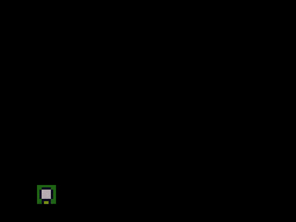

# NDWFC

A Wave Function Collapse implementation with infinite canvas in arbitrary number of dimensions.

### [Online Demo](https://ndwfc.glitch.me/)

- Based on the algorithm of [the original Wave Function Collapse](https://github.com/mxgmn/WaveFunctionCollapse).
- For the browser and node.js
- Works with web worker multithreading
- Infinitely expandable canvas
- 2D/3D/ND





## Installation

Browser

```html
<!-- the main library -->
<script src="ndwfc.js"></script>

<!-- optional helpful tools -->
<script src="ndwfc-tools.js"></script>
```

Node.js

```JavaScript
// the main library
const WFC = require('./ndwfc');

// optional helpful tools
const {WFCTool2D,WFCTool3D} = require('./ndwfc-tools');

```

## Usage

The main library, `ndwfc.js`, doesn't make any assumption about what you're trying to generate. It is an abstracted implementation of the WFC algorithm, while `ndwfc-tools.js` provide helpful functions for practical usage such as generating tiled textures or models.

Below are some sample code, but be sure to check out `index.js` for detailed usage and examples.

### Basics

```JavaScript
var nd = 2;             // number of dimensions (2, 3, etc.)
var weights = [1, 1, 1] // weight for each type of tile
                        // this also implies the total number of tiles
                        // here all weights are equal, so the tiles will
                        // generate at equal probability
                        
// the rules is an array of 3-tuples.
// for each rule, the first element specifies the axis, and the 2nd and 3rd
// specifies what tiles can go next to each other on that axis

var rules = [
	['x',0,1],  // 0th tile can be placed to the left of 1st tile
	['x',1,0],  // 1st tile can also be placed to the left of 0th tile
	['y',1,2],
	            // if you have more than 3 dimensions, the axis can be specified
	            // using integers instead of 'x', 'y' and 'z'.
	            // in fact 'y' is an alias of 0th axis, 'x' the 1st, and 'z' the 2nd
	...
	...
]

var wfc = new WFC({nd, weights, rules});  // initialize the wfc!


// define a region of interest inside which you want tiles to be generated
// by passing two corners of the bounding box/cube/hypercube
var size = 5;
wfc.expand([-size,-size],[size,size]);  

// the main loop
// subsitute with setTimeout/requestAnimationFrame/WebWorker depending on usage
                            
while (true){
	var done = wfc.step();  // advance 1 step, filling at least 1 new coordinate.
	                        // step() returns true if the region of interest has
	                        // been entirely filled
	                        
	if (done){ 
		size += 5           // all space filled, time to expand more
		wfc.expand([-size,-size],[size,size]);  // newly marked area will begin to 
		                                        // be generated in the next step()
	}
	
	console.log(wfc.readout());
	// ^ get the current result, an object mapping coordinate to tile index
	// something like {'1,2':0, '2,2':2, '3,1':1, ...}
	
	// use wfc.readout(false) to read the result as probability distribution,
	// something like {'1,2',[1,0,0], '2,2':[0.3,0.2,0.5], ...}
	
}
```

### Using the 2D/3D tile helpers

`ndwfc-tools.js` provides helpers for generating 2D and 3D content. You can use strings of characters to describe the semantics of your tiles, and the tool can figure out what can go next to what and generate the rules for you. Though the tool is also capable of simple visualization using canvas (2D) or three.js (3D), you can just grab the result from `wfc.readout()` and plug in your own assets such as image files and 3D models to produce the visuals you want.

```JavaScript

// initialize the 2d tool
var tool = new WFCTool2D();

// add an 3x3 "L" shaped tile
tool.addTile(`\
.@.
.@@
...`)
// ^ all rotated versions of the tile will also be added,
// unless you specify otherwise (see below)

// add an 3x3 "I" shaped tile
tool.addTile(`\
.@.
.@.
.@.`,
{transformations:['cw']})
// ^ for this tile, we only need itself and a clockwise 90 deg rotated version
// for 2D tiles, transformations can include 'cw', 'fx' (flip x) and 'fy' (flip y).
// you can also combine them using '+'
// e.g. for anti-clockwise 90 deg rotation you can do 'cw+cw+cw'
// duplicates will be detected and will not be added multiple times.

// add a plain tile
tool.addTile(`\
...
...
...`,
{transformations:[],weight:0.1})
// you can specify the weight of the tile. higher the weight,
// more often it will appear. default is 1.


// rules are automatically generated based on this logic:
// only tiles with an identical edge can go next to each other, like so:
// .@.     ...
// .@@  +  @@@
// ...     ...
// the tiles below can NOT go next to each other:
// .@.     ...
// .@@  +  ...
// ...     ... 
// because the right edge of 1st tile does not match left edge of the 2nd
// same for vertical axis.


// define the color of the symbols.
// this is used only to quickly visualize the results
// you won't need this if you're using your own assets
tool.addColor("@", [255,0,0])
tool.addColor(".", [0,255,255])


// print a summary of automatically generated version of the tiles
// you'll need this if you're using your own assets
// each formula is a 3-tuple:
// the first element is the original index (the order you called `addTile`)
// the second element is the transformations applied (e.g. 'fx+cw')
// the third element is the transformed version
console.log(tool.getTileFormulae());

// this generates all the input which you can directly pass to WFC
var wfcInput = tool.generateWFCInput();
var wfc = new WFC(wfcInput);

... 
... // see previous section on how to use wfc
...

// visualize the output on a HTML canvas
var canvas = document.createElement("canvas");

var viewport = {x:0,y:0,w:10,h:10}; // the region you want to visualize
tool.plotWFCOoutput(canvas, viewport, wfc.readout()); // plot it!


```

`WFCTool3D` is similar to `WFCTool2D`, see `index.js` for usage example.